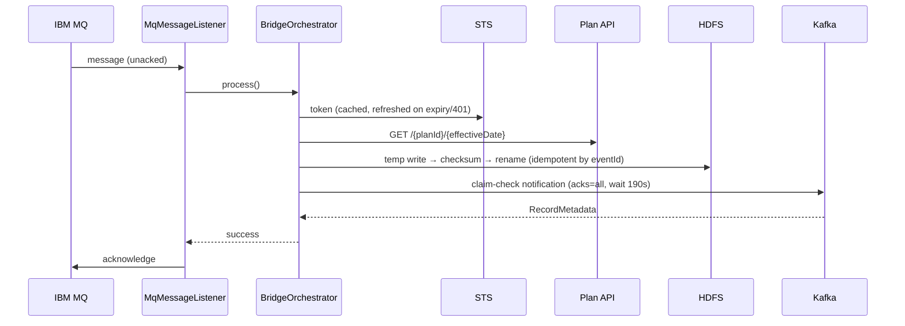

# Evaluation: Decoupling MQ Consumption from REST Processing

Status: **evaluation only — no implementation without explicit approval.**
Companion to `PRODUCTION_READINESS_REVIEW.md` (phase 15 of the production-readiness
program).

## The question

Should the current synchronous design

```
MQ → [parse → STS token → REST enrich → HDFS write → Kafka publish] → MQ ack
```

be replaced with a staged, Kafka-buffered design?

```
MQ → Kafka request topic → REST worker → Kafka response/notification topic
        (thin, fast ack)      (own pace)        (existing consumers)
```

## Current-state architecture (as built)

One JVM, one pipeline thread (`bridge.mq.concurrency=1`, enforced — the HDFS
exists/write/rename sequence is not atomic across writers). The MQ message stays
unacknowledged for the full pipeline duration; every failure mode resolves to one of
three terminal outcomes (ack, quarantine+ack, discard+ack) or to no-ack → broker
redelivery with client-side backoff. Delivery semantics: **at-least-once end to end**,
with duplicates suppressed by the deterministic `eventId` (HDFS idempotent write,
downstream consumer dedupe).

Worst-case single-message wall clock (from configuration):

| Stage | Bound | Source |
|---|---|---|
| Enrichment (3 attempts × 30s timeout + backoff) | ~93s | `bridge.api.*` |
| Kafka publish wait | 190s | `bridge.kafka.timeout-seconds` |
| HDFS write | unbounded by config (RPC timeouts apply) | hadoop client |
| **Total unacked window** | **~5 minutes** worst case, ~1-3s typical | |

## Comparison

| Dimension | Current (synchronous) | Decoupled (request topic) |
|---|---|---|
| Reliability | At-least-once; single well-understood ack point | At-least-once per hop; TWO commit points to reason about (MQ→topic, topic→worker) |
| MQ transaction duration | Up to ~5 min unacked worst case; typical seconds | Milliseconds — ack after topic append |
| API outage behavior | Message redelivers with backoff; queue depth grows on the QM (visible via CURDEPTH) | Backlog accumulates in Kafka; MQ drains regardless; replay from offsets |
| Backpressure | Inherent: 1 in-flight message, no internal queues, zero memory growth | Must be built: worker lag monitoring, pause/resume on consumer |
| Replay | MQ-side only (backout/requeue); after ack, replay = consumer re-reads Kafka notification | Native: rewind request-topic offsets |
| Scalability | Vertical only; concurrency pinned to 1 by the HDFS write race | Horizontal workers, partitioned by `eventId`/plan id |
| Ordering | FIFO per queue preserved trivially (one consumer) | Per-partition only; needs a deliberate key (marketing plan id) |
| Idempotency | Already deterministic (`eventId`); duplicates suppressed | Same mechanism carries over unchanged — the one thing that ports cleanly |
| Operational complexity | One service, one supervisor stack (systemd/keepalive/monitor already built) | +1 topic, +1 consumer group, +1 deployable worker, +lag alerting, +DLQ topic |
| Infrastructure | Exists today | New topic(s) + ACLs + retention decisions on a shared enterprise cluster |
| Monitoring | Health endpoint, monitor mode, gap check — all built and deployed | All of that must be rebuilt for the worker + lag dashboards |
| DR | QM + HDFS + topic already covered by platform DR | Adds request-topic retention/DR to the story |
| Throughput ceiling | ~1 message / 1-3s ≈ 1,200-3,600/hour (measured limit is REST latency) | Limited by REST rate and worker count, not by MQ ack |
| End-to-end latency | Lowest possible (no extra hop) | +1 Kafka round trip + worker poll interval |

## Decision drivers checklist (from the program's criteria)

| Trigger for decoupling | Present here? | Evidence |
|---|---|---|
| REST latency unpredictable | Partially — 30s timeout ×3 exists, but typical calls are fast | `bridge.api.timeout-seconds=30` |
| API outages lasting minutes | Possible (enterprise gateway) — but MQ absorbs them today: no-ack + backoff + CURDEPTH alerting | redelivery backoff, monitor exit 2/3 |
| High throughput expected | **No.** BluePCS product-change events are low-volume (queue depth alerting thresholds in ops docs are double digits) | DEPLOYMENT_CHECKLIST monitoring section |
| Strict API rate limits | Not documented; concurrency=1 is already the strongest rate limit | — |
| Replay required | Covered differently: HDFS landing retention (7d) + archive (30d) + audit trail; consumer replays from the notification topic | RECONCILIATION_PLAN.md |
| MQ transactions open too long | Worst case ~5 min is within normal QM tolerances at this volume; not observed as a problem | timeout math above |
| Nested retries today | In-process retries × MQ redelivery exist but are bounded and backed off (fixed in the error-handling pass) | listener backoff, bounded API retries |
| Workers need independent scaling | **No** — the binding constraint is the single-writer HDFS landing directory, which a worker fleet would inherit | HDFS race comment, `MqConfiguration` |

## Recommendation

**Keep the synchronous design.** Two or fewer decision drivers are genuinely present,
and the strongest argument for decoupling (long-lived MQ transactions under API
outage) is already mitigated by no-ack redelivery with backoff — IBM MQ *is* the
durable buffer in this architecture. Decoupling would:

1. add a second at-least-once boundary (more duplicate paths, not fewer),
2. re-introduce the horizontal-scaling question that the HDFS single-writer
   constraint forbids anyway,
3. and roughly double the operational surface (topics, ACLs, lag alerting, a second
   deployable) for a flow whose measured bottleneck is REST latency, not MQ ack
   latency.

Revisit if any of these change: sustained volume above ~1,000 msgs/hour; an API SLA
forcing sub-second MQ ack; a move of the landing write to an object store or a
partition-safe layout that unlocks multi-writer; or a platform mandate to drain MQ
eagerly.

### If it is ever approved — migration sketch (for completeness)

1. **Topic design**: `QDA_PRODUCT_BRIDGE_REQUEST` (key = marketing plan id for
   per-plan ordering; retention ≥ landing retention; DLQ
   `QDA_PRODUCT_BRIDGE_REQUEST_DLQ`).
2. **Envelope**: current `MqMessage` fields + `eventId` + `receivedAt` + schemaVersion —
   the existing deterministic `eventId` derivation moves to the thin MQ-side shovel.
3. **Phases**: (a) deploy shovel writing to request topic in shadow mode while the
   existing bridge keeps running; (b) deploy worker consuming the request topic into the
   existing enrich→HDFS→Kafka code path (the orchestrator is already transport-agnostic
   — it takes an `MqMessage` POJO); (c) cut over by disabling the bridge listener
   (existing `bridge.mq.listener-enabled` flag); (d) rollback = re-enable listener,
   stop worker — the idempotent `eventId` makes overlap safe.
4. **Idempotency model**: unchanged — `eventId` keys HDFS writes, Kafka records, and
   consumer dedupe; duplicates across the cutover collapse exactly as redeliveries do
   today.

## Sequence diagrams

Success (current):



Failure branches (current): retryable → no ack → redeliver with backoff; permanent
parse/enrichment → quarantine to HDFS `errors/` → ack; poison threshold → quarantine +
discard audit → ack.
